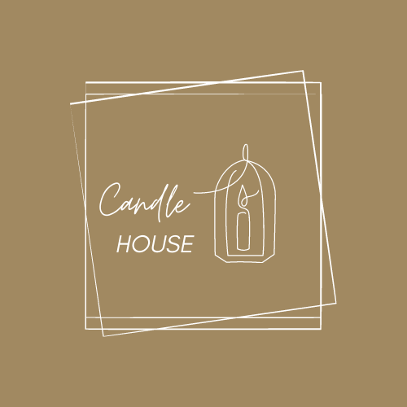
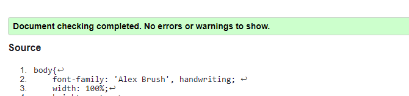
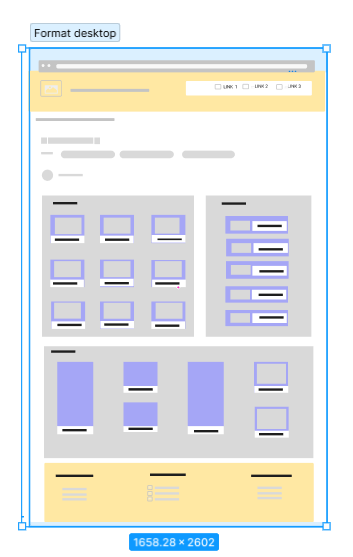
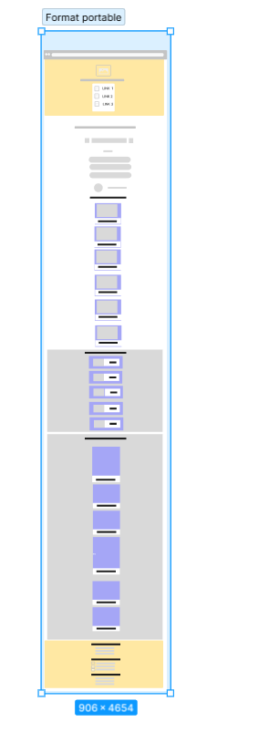
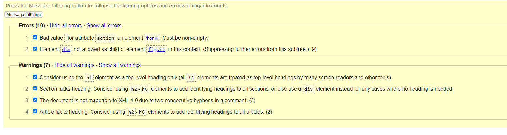

 
# KS CANDLE

Il s'agit d'un projet d'intégration front-end d'un site web responsive en HTML5/CSS3.

# CONTEXTE 

kscandle is a fictitious company, offering a search tool for candles. The site allows users to find all types of candles and choose the store of their choice. The candles can also be filtered by theme, for example the style of the decorative, occasion or floral candle.C'est une pâge statique

# FONCTIONNALITES

- Le champ de recherche est un champ de saisie dont le texte peut être modifié par l'utilisateur.
Les filtres doivent changer d'apparence au survol.
- Dans le menu, les liens « Nos meilleures bougies » et « Nos boutiques » sont des ancres qui doivent mener aux rubriques de la page.

# CONTRAINTES TECHNIQUES
- Aucun élément n'est coupé et le texte a une taille suffisante quelle que soit la taille
  du médium.
- Version portable, tablette, pc
- J'ai fait le logo sur `canvas`
- Configurer les requêtes médias
- Style de police : [font-bunny](https://fonts.bunny.net).
- Icône avec : [font-bunny](https://fontawesome.com/) et [icone8](https://icones8.fr/icons/set/contact)

# ENVIRONNEMENT DEVELOPPEMENT

- Code Visual Studio
- J'ai également versionné mon code avec Git et GitHub. Vous trouverez le dépôt [kscandle](https://github.com/karine-schobert/kscandle)

# DECOUPAGE DES MAQUETTES 

1. Réalisation de maquettes au format portable, portable avec [FIGMA](https://www.figma.com/fr/)
1. Rassemblez des ressources (images, icônes, polices)
2. Définition de la structure HTML du site pour qu'elle soit propre et cohérente
3. Intégration des différentes parties : Header, main, footer
4. Rédaction de CSS (en utilisant flexbox) et implémentation de points d'arrêt
5. Validation W3C du CSS 
6. Ce projet a été imaginé de A à Z, les images ont été prises sur internet et
   libre de droit

 , 

## DIFFICULTEES RENCONTREES 

- Mise en place du html en respectant la sémantique et utiliser les bonnes `<balises>`
- Mise en place du CSS ses classes pour essayer de respecter la méthode Bem 
- Mise en place du responsive avec ses medias-Queries

## Evolution du projet 

- Activer tous les liens de la page sur la navigation et footer 
- Rendre la barre de recherche dynamique 
- Realiser la correction du html verifiée par le W3C  

## VOS SUGGESTIONS

Je suis en formation chez Oclock, n'hésitez pas à me faire part de vos suggestions
