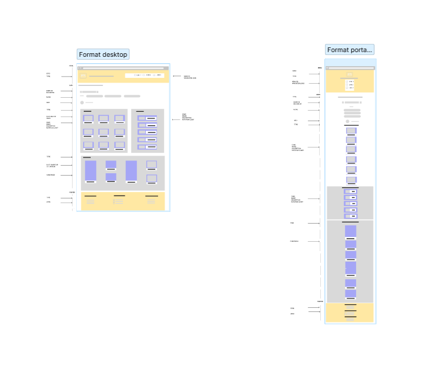

 

# KS CANDLE

Il s'agit d'un projet d'intégration front-end d'un site web responsive en HTML5/CSS3.

# CONTEXTE 

kscandle est une entreprise fictive, proposant un outil de recherche de bougies. Le site permet aux utilisateurs de trouver tous les types de bougies et de choisir le magasin de leur choix. Les bougies peuvent également être filtrées par thème, par exemple le style de la bougie décorative, d'occasion ou florale.C'est une page statique

# FONCTIONNALITES

`Menu`
- Dans la navigation il y aura un logo , un titre, 3 liens de navigations (accueil, panier, contact )mais ne sont pas actifs pour le moment

`Main`

- Le champ de recherche est un champ de saisie dont le texte peut être modifié par l'utilisateur.
- Les filtres doivent changer d'apparence au survol. 
- Il y aura un bloc d'images a gauche et à droite chacun aura un background gris clair
- Chaque card aura un fond blanc et les bords arrondis
- Concernant les images elles doivent êtres centrées et il y aura un titre, une description, est une notation client par des etoiles
- Il y aura un bloc d'image qui se positionnera en dessous des 2 blocs droite et gauches

`Footer`

- 3 bloc centrés avec un titre (A propos de nous, restons connecter, nous contacter)
- Mettre en place des icones (facebook, instagram, Youtube) 

# CONTRAINTES TECHNIQUES

- Aucun élément n'est coupé et le texte a une taille suffisante 
- Version portable, tablette, pc
- J'ai fait le logo sur `canvas`
- Configurer les requêtes médias
- Style de police : [font-bunny](https://fonts.bunny.net).
- Icône avec : [font-bunny](https://fontawesome.com/) et [icone8](https://icones8.fr/icons/set/contact)

# ENVIRONNEMENT DEVELOPPEMENT

- Code Visual Studio
- J'ai également versionné mon code avec Git et GitHub. Vous trouverez le dépôt [kscandle](https://github.com/karine-schobert/kscandle)

# DECOUPAGE DES MAQUETTES 

1. Réalisation de maquettes au format portable, portable avec [FIGMA](https://www.figma.com/fr/)
  
2. Rassemblez des ressources (images, icônes, polices)
3. Définition de la structure HTML du site pour qu'elle soit propre et cohérente
4. Intégration des différentes parties : Header, main, footer
5. Rédaction de CSS (en utilisant flexbox) et implémentation de points d'arrêt
6. Validation W3C du CSS 
7. Ce projet a été imaginé de A à Z, les images ont été prises sur internet et
   libre de droit
8.  Rédaction d'un cahier des charges a suivre [CDC](../kscandle/kscandle_cdc.pdf)

## DIFFICULTEES RENCONTREES 

- Mise en place du html en respectant la sémantique et utiliser les bonnes `<balises>`
- Mise en place du CSS ses classes pour essayer de respecter la méthode Bem 
- Mise en place du responsive avec ses medias-Queries

## Evolution du projet 

- Activer tous les liens de la page sur la navigation et footer 
- Rendre la barre de recherche dynamique 
- Realiser la correction du html verifiée par le W3C  

## VOS SUGGESTIONS

Je suis en formation chez Oclock, n'hésitez pas à me faire part de vos suggestions
